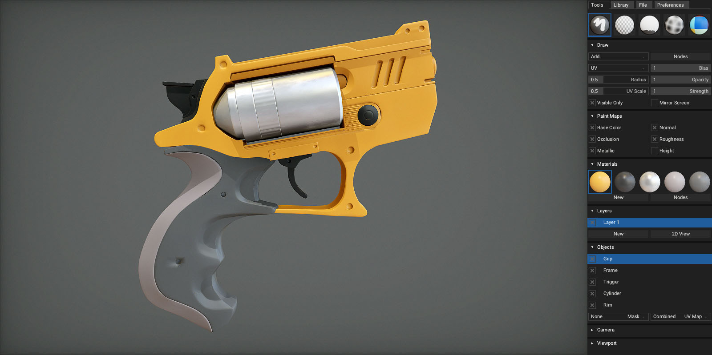
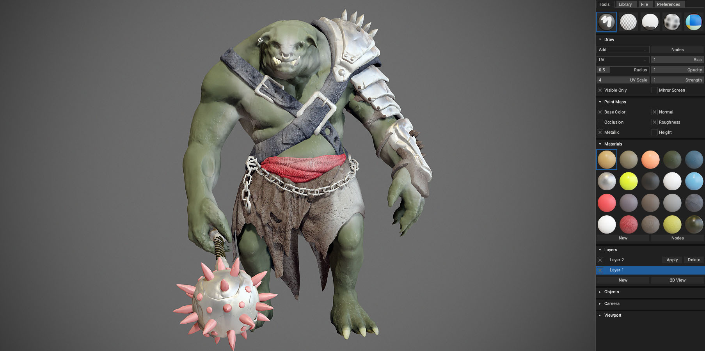

# Welcome


ArmorPaint is an in-development software specialized in PBR texture painting of 3D models. Import geometry and start painting right away. A modern viewport provides instant visual feedback as you paint.

*The preview version has many rough edges and the experience may be frustrating.*

---

# Download

**Windows** and **Linux** is recommended. An unsigned **macOS** build is also provided. ArmorPaint is a portable application with no installation, just unpack and run. Download size is ~6MB, ~15MB unpacked.

- [Get ArmorPaint](http://armorpaint.org/download.html)

#### Requirements

ArmorPaint runs on the GPU and the performance mainly depends on a graphics card. Recommended minimum for 4K painting is an Intel HD4000 graphics card. For 16K painting, GTX 1060/6GB or better is recommended.

# Get Started

<iframe width="560" height="315" src="https://www.youtube.com/embed/OzRqXIsvahg?rel=0" frameborder="0" allow="autoplay; encrypted-media" allowfullscreen></iframe>

#### Windows

Unpack downloaded archive and run `ArmorPaint.exe`. In some cases, Windows may prompt you with the [unrecognized app dialog](http://armorpaint.org/manual/img/startup_win.png) - press `More Info - Run Anyway`.

#### Linux

Open terminal in the extracted folder and run `./ArmorPaint`.

#### macOS

*Experimental:* Unsigned app is provided. See `instructions.txt` file in the extracted folder.

#### Controls

- `Left mouse button / Pen` to paint
- `Right mouse button` to rotate the mesh
- `Middle mouse button` to pan camera
- `Mouse wheel` to zoom in and out
- See `Preferences - Controls` for keyboard shortcuts

# Workflow



You can download sample assets for testing [here](https://github.com/armory3d/armorpaint_samples/releases).

#### Import Meshes

Drag and drop unwrapped `.obj` file into the viewport. This will replace the currently painted mesh. `.fbx`, `.blend` and `.gltf` files are supported, but the importer is not 100% reliable yet.

#### Import Materials

Drag and drop a folder with PBR texture set onto the viewport. ArmorPaint will automatically create a new material from imported textures. Importing Cycles materials from `.blend` format is in progress but not yet supported.

#### Import Textures

Drag and drop `.jpg`, `.png`, `.tga` or `.hdr` images into the node editor. This will import the image and create a new `Image` node.

#### Export Textures

Click on the `File - Export - Export Textures` button. Format, resolution and channels to export can be configured.

#### Export Mesh

Export the currently loaded mesh into an `.obj` file. This is handy if you only have access to the project file. Click on the `File - Export - Export Mesh` button.

#### Save / Load Project

Click on the `File - Project Save` button or hit `Ctrl + S` to save the currently opened project. Mesh, layers and materials will be saved into `.arm` project file.

To open the project file, drag and drop `.arm` file onto the viewport.

# Materials


Materials in ArmorPaint are composed with nodes. When painting, brush applies a material onto the surface. To setup a material, open node editor by clicking `Tools - Material - Nodes` or hit `TAB`. Use toolbar at the top to add new nodes.

You can see the material preview instantly in the `Materials` panel as the nodes are assembled.

*See [Import Materials](http://armorpaint.org/manual/#/?id=import-materials)*

# Painting


#### Draw


Select `Draw` tool from toolbar. Configure brush parameters in `Tools - Draw`. Press `Left mouse button` to paint strokes.

**Sticker**

Set `Paint` combo property located in `Tools - Draw` to `Sticker`. `Left mouse button` to project stickers onto surface.

#### Erase


Select `Erase` tool from toolbar. Only strokes on the second layer or higher can be erased.

#### Fill


Select `Fill` tool from toolbar. `Left mouse button` to fill active object and layer with selected material.

**Auto-Fill**

Enable this option to perform a fill instantly as you change the material. This is useful to quickly preview material on target surface.

#### Bake Ambient Occlusion


Select `Bake` tool from toolbar and click on a model in viewport to bake AO. Strength, radius and offset can be configured. Afterwards, you can prevent the occlusion texture from being painted on by disabling it in the `Paint Maps` panel.

#### Pick Color ID


Select `Color ID` tool from toolbar. Drag and drop color-id texture onto the viewport and assign it into the `Color ID Map` field. Afterwards, click on a model to pick a specific color. All drawing operations will now be restricted to this color. Picked color can be removed with a `Clear` button.

#### Painting height

Select `Draw` tool from toolbar. Enable `Height` checkbox located in `Tools - Paint Maps` panel. Afterwards, `Height` socket exposed in material node editor will take effect.

#### Paint Maps

This panel allows to set which textures can be painted on.

#### Layers

To create a new layer, click `Tools - Layers - New`. Brush will paint on the currently selected layer. Afterwards, layer can be deleted or applied to the base layer 1.

#### Objects

If you import a geometry containing multiple objects, you can list them in the `Objects` panel. Set `Mask` property to `Object` to restrict painting to selected object only.

Objects are assumed to be using a single UV map for now. `.obj` format is recommended for multi-object support.

#### 2D View

Click `Layers - 2D View` to show the texture of the selected layer. The 2D View is updated immediately as you paint. In the top panel, you can select which texture to show or display UV map.

#### Camera

Set camera type and parameters.

- `ArcBall` - rotate mesh around the origin
- `Orbit` - rotate camera around the mesh
- `Fly` - move camera freely using the `WASD` keys

#### Viewport

- Set light and environment intensity
- Set specific texture channel to show in the viewport
- Based on imported model, you can flip `Up Axis` to `Y` or `Z`
- Enable `Show Envmap` to draw environment map in the viewport
- *Experimental:* You can drag and drop 2K `.hdr` file onto the viewport to change the environment map

# Preferences



#### UI Scale

When running on high-resolution display, scale up the user interface in `Preferences - UI Scale`.

#### Layout

User interface can be displayed either on the left or right side.

#### Theming

Theme can be tweaked by editing the `theme.arm` file placed in the `data` folder. A proper theme editor will be provided in the future.

#### Pen Pressure

When painting with a pen, pressure affects the radius of brush.

#### Undo Steps

Sets the number of undo steps to preserve. Using less undo steps may improve performance when running on slower GPU with constrained memory.

#### Viewport

Configure viewport effects. On faster GPUs, raise the shadows quality or set super-samling to 2.0x for improved anti-aliasing. On slower GPUs, disable SSAO, shadows or set super-sampling to 0.5x for improved performance.

# Plugins

To enable plugins, edit the `config.arm` file placed in the `data` folder. A plugin filename can be entered into the `plugins` array. A proper plugin manager will be provided in the future.

Plugins are written in JavaScript or WebAssembly. For a minimal example, see the bundled [plugin_hello.js](https://github.com/armory3d/armorpaint/blob/master/Bundled/plugin_hello.js) and [plugin_rotate.js](https://github.com/armory3d/armorpaint/blob/master/Bundled/plugin_rotate.js) located in the `data` folder.

```json
{
	...
	"plugins": ["plugin_hello.js"]
}
```
