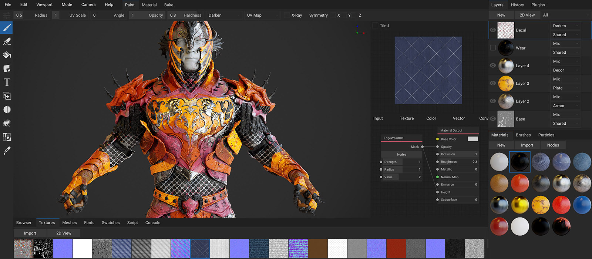

# Welcome



*The following is an in-progress quick start guide*

ArmorPaint is a stand-alone tool specialized in physically based texture painting of 3D models. Import  geometry and start painting right away. A modern viewport provides instant visual feedback as you paint.

---

# Download

Runs on **Windows** and **Linux**. **macOS** builds are provided, but currently as unsigned app.

- [Get ArmorPaint](http://armorpaint.org/download.html)

### Requirements

As of now ArmorPaint is known to work on Intel HD4000 graphics card for 4K texture painting. For 16K textures, GTX 1060/6GB or better is recommended. ArmorPaint runs on the GPU and the performance mainly depends on a graphics card.

### Limitations

Only one-step undo is supported and masking features are limited to color id maps. These issues will be resolved in upcoming builds.

# Get Started

<iframe width="560" height="315" src="https://www.youtube.com/embed/OzRqXIsvahg?rel=0" frameborder="0" allow="autoplay; encrypted-media" allowfullscreen></iframe>

### Windows

Run `ArmorPaint.exe`. In some cases, Windows may propt you with the [unrecognized app dialog](http://armorpaint.org/manual/img/startup_win.png) - press `More Info - Run Anyway`.

### Linux

Open terminal in the extracted folder and run `./ArmorPaint`.

### macOS

*Experimental:* See `instructions.txt` file in the extracted folder.

### Controls

- `Left mouse button` to paint
- `Right mouse button` to rotate the mesh
- `Middle mouse button` to pan camera
- `Mouse wheel` to zoom in and out
- `Tab` to show material nodes
- `Ctrl+Z` to undo
- `Shift+[1,2,3,4,5]` to quick-select tool
- `Alt+[1,2,3,4,5]` to quick-select material
- `x` or `backspace` to delete node

# Assets

### Import Meshes

Drag and drop unwrapped `.obj` file into the viewport. This will replace the currently painted mesh. `.fbx` and `.gltf` files are supported, but the importer is not 100% reliable yet and may fail. Importing `.blend` format is in progress but not yet supported. Use Blender to do the conversion in the meantime.

As a quick test, you can import the `monkey.obj` file located in the extracted ArmorPaint folder. 


### Import Materials

Importing Cycles materials from `.blend` format is in progress but not yet supported. Assemble materials in the built-in node editor for now.

### Import Textures

Drag and drop `.jpg`, `.png`, `.tga` or `.hdr` images into the node editor. This will import the image and create a new `Image` node.

### Export Textures

Click `Export - Export Textures`. Format, resolution and channels to export can be configured.

# Materials

Material nodes in ArmorPaint are based on Cycles nodes. When painting, brush applies a material onto the surface. To setup material, invoke node editor with `Tools - Material - Nodes`. Use toolbar at the top to add new nodes.


# Painting

### Draw

Select `Draw` tool from toolbar. Configure brush parameters in `Tools - Draw`. `Left mouse button` to paint strokes.

### Sticker

Select `Draw` tool from toolbar. Set `Paint` combo propertry located in `Tools - Draw` to `Sticker`. `Left mouse button` to project stickers onto surface.


### Erase

Select `Erase` tool from toolbar. Only strokes on the second layer can be erased currently.

### Fill

Select `Fill` tool from toolbar. `Left mouse button` to fill active layer with selected material.

### Bake Ambient Occlusion

*Experimental:* Select `Bake` tool from toolbar and click on a model in viewport to bake AO.

### Pick Color ID

Select `Color ID` tool from toolbar. Drag and drop color-id texture onto the viewport and assign it into the `Color ID Map` field. Afterwards, click on a model to pick a specific color. All drawing operations will now be restricted to this color. Picked color can be removed with a `Clear` button.

### Painting height

Select `Draw` tool from toolbar. Enable `Height` checkbox located in `Tools - Draw`. Afterwards, `Height` socket exposed in material node editor will take effect.

### Layers

To create a new layer, click `Tools - Layers - New`. Brushes will be painted on the currently selected layer. Afterwards, layer can be deleted or applied to the base layer 1. Only two layers at once are supported as of now.


### 2D View

Click `Layers - 2D View` to show the texture of the selected layer. The 2D View is updated immediatelly as you paint.

# Preferences

### Scaling

*Experimental:* It is possible to scale up the user interface in `Preferences - UI Scale`. Once set, hit `Save` to remember the setting.

### Pen Pressure

When painting with a pen, pressure affects the radius of brush.

### Theming

UI theme can be configured by editing the `theme.arm` file placed alongside the ArmorPaint binary. A proper theme editor will be provided in the future.

### Undo

Controls whether undo system is active. Disabling may improve performance when running on slower GPU.

# Plugins

To enable plugins, edit the `config.arm` file placed in the `ArmorPaint/data` folder. A plugin filename can be entered into the `plugins` array. A proper plugin manager will be provided in the future.

Plugins are written in JavaScript or WebAssembly. For a minimal example, see the bundled [plugin_hello.js](https://github.com/armory3d/armorpaint/blob/master/Bundled/plugin_hello.js) and [plugin_rotate.js](https://github.com/armory3d/armorpaint/blob/master/Bundled/plugin_rotate.js).

```json
{
	...
	"plugins": ["plugin_hello.js"]
}
```
