# Welcome

*Version [0.8dev](https://github.com/armory3d/armorpaint_docs)*

ArmorPaint is a stand-alone software designed for physically-based texture painting. Drag & drop your 3D models and start painting. Receive instant visual feedback in the viewport as you paint.

> The preview version has many rough edges and the experience may be frustrating.

---

# Download

**Windows** and **Linux** is recommended. Experimental **macOS** and **Android** builds are also provided. ArmorPaint is a portable application with no installation, just unpack and run.

> [Get ArmorPaint](https://armorpaint.org/download.html)

#### Requirements

Painting process in ArmorPaint runs on the GPU and the performance mainly depends on a graphics card. Minimum for 4K painting is an Intel HD4000 graphics card. For 16K painting, GTX 1060/6GB or better is recommended.

> See [Preferences](https://armorpaint.org/manual/#/?id=preferences) to tune performance.

#### Updating

Latest builds can be downloaded through your [Gumroad Library](https://gumroad.com/library). Alternatively, use the original email sent by Gumroad to access the download page.

> In ArmorPaint, press `Help - Check for Updates...` to check if newer build is available.

     

# Get Started

<iframe width="560" height="315" src="https://www.youtube.com/embed/qNHeNetQNvE" frameborder="0" allow="accelerometer; autoplay; encrypted-media; gyroscope; picture-in-picture" allowfullscreen></iframe>

#### Windows

Unpack downloaded archive and run `ArmorPaint.exe`. In some cases, Windows may prompt you with the unrecognized app dialog - press `More Info - Run Anyway`.

#### Linux

Unpack downloaded archive and run `ArmorPaint`. In some cases, you may need to open terminal in the extracted folder and run `./ArmorPaint`.

#### macOS

Unpack downloaded archive and run `ArmorPaint.app`.

#### Android

*Experimental:* Unpack downloaded archive and see [readme_android.txt](https://github.com/armory3d/armorpaint/blob/master/Assets/readme/readme_android.txt). `ArmorPaint.apk` file is provided.

#### iPadOS

*In development.*

#### Controls

- `Left mouse button / Pen` to paint.
- `Alt` + `left mouse button` to rotate the camera.
- `Alt` + `middle mouse button` to pan the camera.
- `Alt` + `right mouse button` / `mouse wheel` to zoom in and out.
- Controls can be customized in `Menu bar - Edit - Preferences... - Keymap`.
- Default or Blender keymap preset can be selected.
- Keymap presets can be imported and exported.

     

# Workflow

#### Import Meshes

Drag and drop unwrapped `.obj` file into the viewport. This will replace the currently painted mesh. `.fbx`, `.blend`, `.stl`, `.gltf` and `.glb` files are supported, but the importer is not 100% reliable yet.

In the `Import Mesh` dialog:
- Set `Split By` combo to `UDIM Tile` to parse imported `.obj` mesh into UDIM tiles.
- Enable `Parse Transforms` to load per-object transforms from `.fbx` file.
- Enable `Parse Vertex Colors` to load vertex color data from `.fbx` or `.blend` file.

Modifying imported mesh data:
- Normals can be re-calculated with `Meshes tab - Tools... - Calculate Normals`.
- Up axis can be set with `Meshes tab - Tools... - Rotate X / Rotate Y / Rotate Z`.
- UV map can be auto-generated by enabling the `uv_unwrap` plugin.

> You can download sample assets for testing on [GitHub](https://github.com/armory3d/armorpaint_samples/releases).

> See `Menu bar - Preferences... - Plugins` to enable support for additional mesh formats.

#### Import Materials

Drag and drop a folder with PBR texture set onto the viewport. ArmorPaint will recognize the file extensions and create a new material from imported textures. Multiple folders can be dropped at once.

Click on the `Materials tab - Import` button to import materials from ArmorPaint `.arm` files or Blender `.blend` files. *wip*

> You can download starter content from [GitHub](https://github.com/armory3d/armorpaint_lib/releases). *wip*

#### Import Textures

Drag and drop `.jpg`, `.png`, `.tga`, `.bmp`, `.gif`, `.psd`, `.hdr` or `.tif` images into the node editor. This will import the image and place a new `Image` node onto the canvas.

> See `Menu bar - Preferences... - Plugins` to enable support for additional image formats.

#### Export Textures

Click on the `Menu bar - File - Export Textures...` button.

- `Resolution`: Set resolution for exported textures.
- `Color`: Set `8bit`, `16bit` or `32bit` color depth.
- `Format`: `.png` or `.jpg` (for `8bit` color), `.exr` (for `16bit / 32bit` color).
- `Layers`: Export all visible layers or selected layers only into textures.
- `Preset`: Select a pre-configured preset or build a custom one.
  - `Generic` preset exports individual PBR textures.
  - `Unreal` preset exports packed *occlusion-roughness-metallic* texture.
  - `Unity` preset exports packed *metallic-occlusion-smoothness* texture.
  - `Minecraft` preset exports packed *metallic-emission-roughness* texture.

Configure custom channel swizzling for exported textures in `Presets` tab:
- Select an existing preset you wish to edit or press `New`.
- Press `Import` to import preset from `.json` file.
- Press `Add` to create new texture slot.
- Configure `RGBA` channels for each texture slot.
- Right-click on texture name and press `Delete` to delete texture slot.
- `.json` file for each preset is located in the `ArmorPaint/data/presets` folder.

#### Export Mesh

Click on the `Menu bar - File - Export Mesh...` button to save the currently loaded mesh into `.obj` file. This is handy if you only have access to the `.arm` project file or want to export the mesh which has been unwrapped / modified in ArmorPaint.

#### Save / Load Project

Click on the `Menu bar - File - Save` button (`Ctrl + S`) to save the currently opened project. Mesh, layers, materials and brushes will be saved into `.arm` project file.

To open the project file, drag and drop `.arm` file onto the viewport. `.arm` files can also be set to open directly with ArmorPaint executable from the OS file explorer.

`.obj` and other asset types can also be associated if you wish to use ArmorPaint as a model / texture viewer.

#### Browser

Click on the `Status bar - Browser tab` to activate the built-in asset browser.
- Drag assets from browser into the viewport to import.
- For `.arm` materials, preview icons are displayed.
- Click on the `+` button to save the current path into bookmarks panel.
 

     

# Tools

#### Brush

Select `Brush`(`B`) tool from toolbar. Configure brush parameters in the header. Use `left mouse button` / `pen` to paint strokes using the selected material.

- `Radius`: Brush size. (Hold `F` key and move the cursor)
- `UV Scale`: Scale the coords for currently painted material.
- `Angle`: Rotate the coords for currently painted material.
- `Opacity`: Overall opacity of the brush stroke. (Hold `Shift+F` key and move the cursor)
- `Hardness`: Fade opacity towards the brush stroke edge.
- `Blending`: Blending mode used for painting.
- `TexCoord`: Coordinates used for texture sampling. Mesh `UV Map`, `Project` from view or `Triplanar` mapping.
- `X-Ray`: Paint through mesh faces.
- `Symmetry`: Mirror brush strokes on the X, Y and/or Z axis.

Hold brush ruler key (`SHIFT`) when painting to restrict strokes horizontally or vertically. Hold brush ruler key (`SHIFT`) and click onto the surface to paint lines.

#### Eraser

Select `Eraser`(`E`) tool from toolbar. Use `left mouse button` / `pen` to erase strokes on the currently selected layer.

- `Radius`: Eraser size.
- `Opacity`: Overall opacity of the eraser stroke.
- `Hardness`: Fade opacity towards the eraser stroke edge.
- `X-Ray`: Erase through mesh faces.
- `Symmetry`: Mirror eraser strokes on the X, Y and/or Z axis.

#### Fill

Select `Fill`(`G`) tool from toolbar. Press `left mouse button` / `pen` to fill active layer with selected material. Fill tool respects active object mask, material mask and color id mask.

- `UV Scale`: Scale the coords for currently painted material.
- `Angle`: Rotate the coords for currently painted material.
- `Opacity`: Overall opacity of the fill effect.
- `Blending`: Blending mode used for fill effect.
- `TexCoord`: Coordinates used for texture sampling. Mesh `UV Map`, `Project` from view or `Triplanar` mapping.
- `Fill Mode`: Allows to fill individual mesh faces.

#### Decal

Select `Decal`(`D`) tool from toolbar. Press `left mouse button` / `pen` to apply active material as a decal onto the surface.

- `Radius`: Decal size.
- `Scale X`: Scale decal size horizontally.
- `UV Scale`: Scale the coords for currently painted material.
- `Angle`: Rotate the coords for currently painted material.
- `Opacity`: Overall opacity of the decal.
- `Blending`: Blending mode used for applying decal.
- `X-Ray`: Apply decal through mesh faces.
- `Symmetry`: Mirror decal on the X, Y and/or Z axis.

#### Text

Select `Text`(`T`) tool from toolbar. Press `left mouse button` / `pen` to apply active material as a text onto the surface. Drag and drop a `.ttf` file into the viewport to change the font.

- `Radius`: Text size.
- `UV Scale`: Scale the coords for currently painted material.
- `Angle`: Rotate the coords for currently painted material.
- `Opacity`: Overall opacity of the text.
- `Blending`: Blending mode used for applying text.
- `Font`: Select which font to apply.
- `Text`: Type a text to apply.
- `X-Ray`: Apply text through mesh faces.
- `Symmetry`: Mirror text on the X, Y and/or Z axis.

#### Clone

Select `Clone`(`L`) tool from toolbar. Hold `ALT` to set clone source location. Use `left mouse button` / `pen` to clone the material from source location to active location.

- `Radius`: Brush size.
- `Opacity`: Overall opacity of the brush stroke.
- `Blending`: Blending mode used for painting.
- `X-Ray`: Paint through mesh faces.
- `Symmetry`: Mirror brush strokes on the X, Y and/or Z axis.

#### Blur

Select `Blur`(`U`) tool from toolbar. Use `left mouse button` / `pen` to smudge the material applied to the surface.

- `Radius`: Brush size.
- `Opacity`: Overall opacity of the brush stroke.
- `Blending`: Blending mode used for painting.
- `X-Ray`: Paint through mesh faces.
- `Symmetry`: Mirror brush strokes on the X, Y and/or Z axis.

#### Particle *wip*

Select `Particle`(`P`) tool from toolbar. Use `left mouse button` / `pen` to apply particles onto the surface.

- `Radius`: Particle emitter size.
- `Opacity`: Overall opacity of the emitted particle.
- `Blending`: Blending mode used for applying particles.
- `X-Ray`: Apply particles through mesh faces.
- `Symmetry`: Mirror particles on the X, Y and/or Z axis.

#### Bake

Select `Bake`(`K`) tool from toolbar. Pick bake mode, then press and hold `left mouse button` / `pen` in viewport to apply bake into the base color channel of active layer or mask. For ray-traced bake modes, multiple samples will get accumulated until the `left mouse button` / `pen` is released.

> See [Baking](https://armorpaint.org/manual/#/?id=baking) to learn about bake modes.

#### Color ID

Select `Color ID`(`C`) tool from toolbar. Drag and drop color-id texture onto the viewport and assign it into the `Color ID Map` field. Afterwards, click on a model to pick a specific color. All drawing operations will now be restricted to this color. Picked color can be removed with a `Clear` button.

#### Picker

Select `Picker`(`V`) tool from toolbar. Press `left mouse button` / `pen` in viewport to read material values from the surface. Base color, normal, occlusion, roughness and metallic values will be displayed in the header.

- `Select Material`: When enabled, the material you pick from the mesh surface will also get auto-selected in the `Materials tab`.
- `Mask`: When set to `Material`, all drawing operations will be restricted to the surface where picked material is painted.

     

# Materials

Materials in ArmorPaint are composed with nodes. When painting, brush applies a material onto the surface. To compose a material, open node editor by clicking `Materials tab - Nodes` (`TAB`).
- Use toolbar at the top to add new nodes.
- Press `space` to search for nodes.
- Drag textures from `Textures tab` or file explorer into the node editor to create `Image` nodes.

Material preview is displayed instantly in the `Materials tab` as the nodes are assembled.

Right-click onto material preview to expose material operations:
- Set which channels the material should affect.
- Create fill layer from selected material.
- Duplicate material.
- Export material into `.arm` file.
- Delete material.

> Drag and drop material into viewport or Layers tab to create a fill layer.

> See [Import Materials](https://armorpaint.org/manual/#/?id=import-materials).

> Implemented material nodes: `Attribute`, `Camera data`, `Layer`, `Layer Mask`, `Material`, `Fresnel`, `Geometry`, `Layer Weight`, `Object Info`, `RGB`, `Tangent`, `Texture Coord`, `UV Map`, `Value`, `Brick Texture`, `Checker Texture`, `Gradient Texture`, `Image Texture`, `Magic Texture`, `Musgrave Texture`, `Noise Texture`, `Voronoi Texture`, `Wave Texture`, `BrightContrast`, `Gamma`, `Blur (Image)`, `HueSatVal`, `Invert`, `MixRGB`, `Bump`, `Mapping`, `Normal`,  `Vector Curves`, `Color Ramp`, `Combine HSV`, `Combine RGB`, `Combine XYZ`, `Math`, `RGB to BW`, `Separate HSV`, `Separate RGB`, `Separate XYZ`, `Vector Math`.

     

# Brushes

Brushes in ArmorPaint are composed with nodes. When painting, brush nodes are evaluated for each painted stroke. To compose a brush, open node editor by clicking `Brushes tab - Nodes (TAB)`.
- Use toolbar at the top to add new nodes.
- Press `space` to search for nodes.
- Drag textures from `Textures tab` or file explorer into the node editor to create `Image` nodes.

Brush preview is displayed instantly in the `Brushes tab` as the nodes are assembled.

Right-click onto brush preview to expose brush operations:
- Duplicate brush.
- Export brush into `.arm` file.
- Delete brush.

> Brushes can be imported from `.arm` files by clicking `Brushes tab - Import`.

> Implemented brush nodes: `Input`, `Value`, `Random`, `Vector`, `Separate Vector`, `Vector Math`, `Math`, `Time`, `Image Texture`.

#### Brush Mask

To use image as a brush mask:
- Drag and drop brush mask image into the node editor.
- Connect newly placed `Image Texture` node to the `Brush Output - Opacity` socket.
 

#### Brush Jitter

- Connect `Random` brush node with `Brush Output` sockets to jitter desired properties.
 <a href="img/brush_jitter.jpg" target="_blank">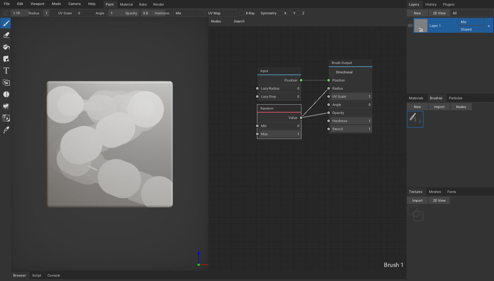</a>

#### Lazy Mouse

- Raise `Lazy Radius` value of the `Input` brush node to make the paint cursor follow the mouse in delay. This can be useful to paint smooth strokes.
- Raise `Lazy Step` value of the `Input` brush node to paint strokes in steps.
 <a href="img/brush_lazy.jpg" target="_blank">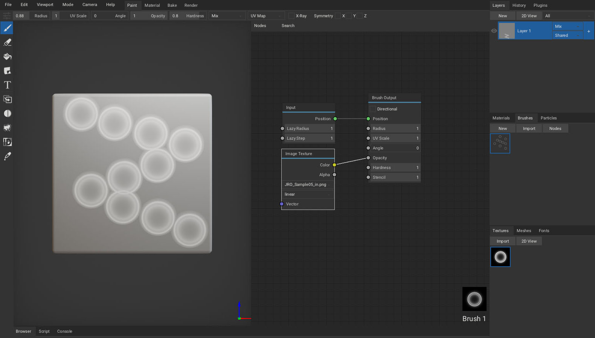</a>

#### Directional Brush

- By enabling the `Direction` value of the `Brush Output` node, painted strokes will follow the brush path. Decal and brush mask will be oriented to match the direction of a brush.
 <a href="img/brush_directional.jpg" target="_blank">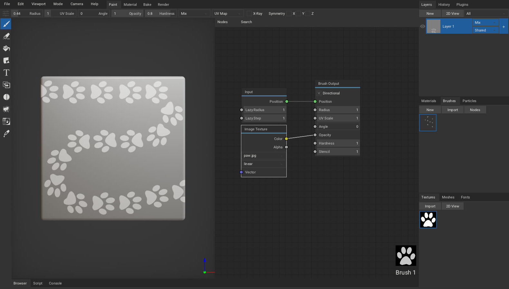</a>

#### Brush Stencil

To use image as a brush stencil:
- Drag and drop stencil image into the node editor.
- Connect newly placed `Image Texture` node to the `Brush Output - Stencil` socket.
- Hold `ctrl` (`stencil_transform`) key to show transform controls.
- Hold `z` (`stencil_hide`) key to make stencil invisible while still taking effect.
 <a href="img/brush_stencil.jpg" target="_blank">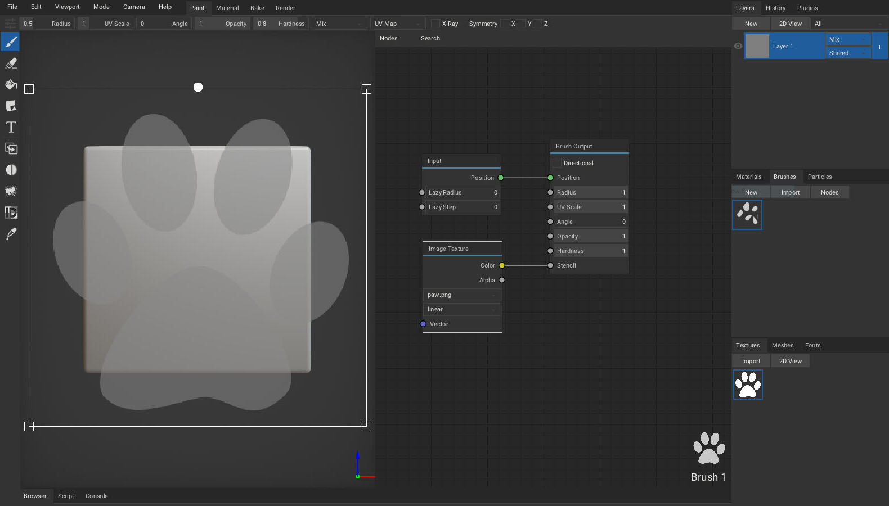</a>

     

# Layers

To create a new layer, press `Layers tab - New`. Brush will paint onto the currently selected layer.
- Layer can be parented to the specific object by setting the `Object` combo property. This allows to utilize multiple UV maps per project - each object having it's individual UV map.
- Reveal the layer properties by clicking the `+` sign to set layer `opacity`, `resolution` and `color` depth. For fill layers, additional `uv scale`, `angle` and `texcoord` properties are available.

Right-click on the layer to expose layer operations:
- Convert layer to `fill layer` or `paint layer`.
- Create a `White Mask` or `Blask Mask`.
- `Merge` the layer down.
- `Duplicate` the layer.
- `Move` the layer up or down.
- `Export` selected layer.
- `Delete` layer.
- Create a `group` containing the selected layer.
- Set which channels the layer should affect.

Right-click on the mask to expose mask operations:
- `Apply` mask to parent layer.
- `Delete` mask.

> Drag textures from `Textures tab` into the viewport or `Layers` tab to create mask for active layer.

#### 2D View

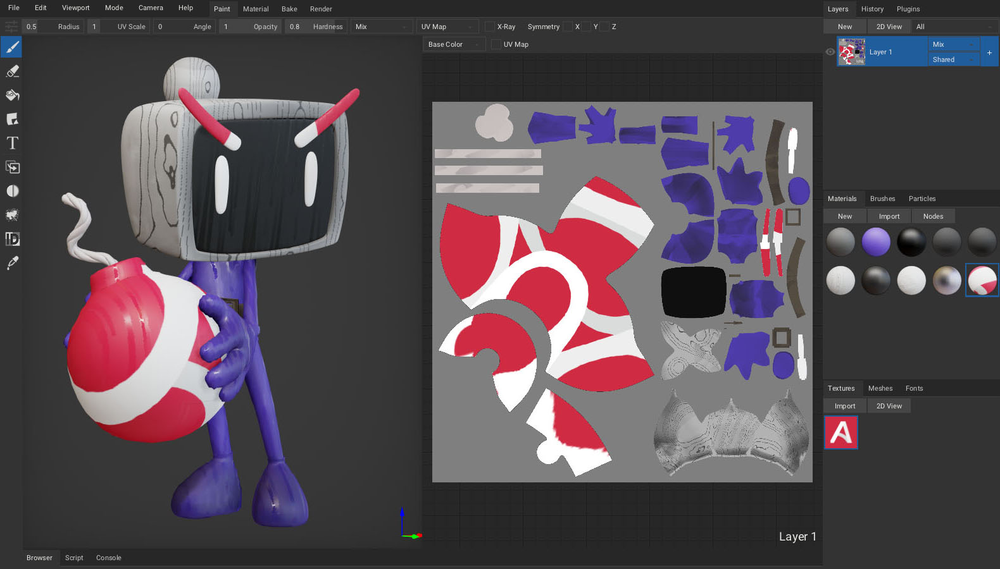

Click `Layers tab - 2D View` to show the channels of the selected layer. The 2D View is updated immediately as you paint. In the top bar, you can select which channel to show or display UV map as a wireframe.

- Paint tools are usable directly inside the 2D view.
- Press `Textures tab - 2D View` to show selected image inside 2D view.

     

# Viewport

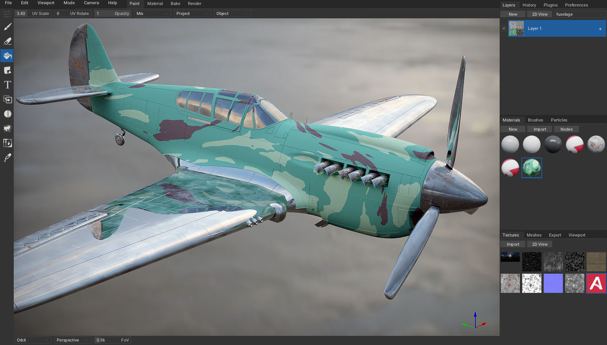

Set viewport parameters in `Menu bar - Viewport`.

- Press `Import Envmap...` or drag and drop a `.hdr` file onto the viewport to change the environment map.
- Enable `Distract Free` (`F11`) mode.
- Set `Environment` and `Light` intensity.
- Set `Light Size`.
- Set `Displace` strength applied by height channel in the viewport.
- Enable `Split View` for side-by-side viewports.
- Enable `Cull Backfaces` to skip drawing backward facing polygons.
- Enable `Filter Textures` to apply linear filter when sampling textures references by material.
- Show `Wireframe` in the viewport.
- Enable `Texels` to visualize texture pixels in the viewport with a checker pattern.
- Show 3D `Compass` in the viewport.
- Enable `Envmap` to draw environment map in the viewport.
- Set `Viewport Color` to draw when environment map is hidden.

> Hold `Shift` + `middle mouse button` to rotate light.

> To simulate pixel-art like painting, disable `Filter Textures` option and set `Super Sample` in preferences to `0.25x`.
>  <a href="img/pixelart.jpg" target="_blank">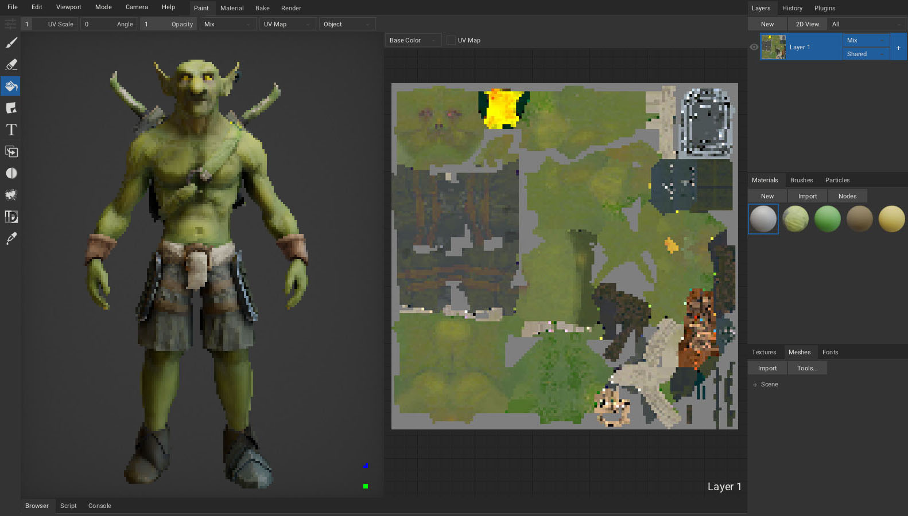</a>

#### Viewport Mode

Set viewport render mode in `Menu bar - Mode`.
- Pick `Lit` to draw viewport with applied lighting using the rasterizer.
- Pick specific channel to visualize it with no applied lighting.
- Pick `Path Traced` to draw viewport with interactive path-tracer. (*[ArmorPaintDXR](https://github.com/armory3d/armorpaint/blob/master/Assets/readme/readme_dxr.txt) and [ArmorPaintVKRT](https://github.com/armory3d/armorpaint/blob/master/Assets/readme/readme_vkrt.txt) builds*)

#### Path Traced Viewport *wip*

- Available in ArmorPaintDXR and ArmorPaintVKRT builds (see [dxr requirements](https://github.com/armory3d/armorpaint/blob/master/Assets/readme/readme_dxr.txt) and [vkrt requirements](https://github.com/armory3d/armorpaint/blob/master/Assets/readme/readme_vkrt.txt)).
- The renderer favors performance.
- Only selected layer gets displayed - this will be resolved in the future. *wip*

<iframe width="560" height="315" src="https://www.youtube.com/embed/uQb-LOJdYrE" frameborder="0" allow="accelerometer; autoplay; encrypted-media; gyroscope; picture-in-picture" allowfullscreen></iframe>

#### Camera

Set camera parameters in `Menu bar - Camera`.

- Set specific camera viewpoint.
- Reset camera.
- Set field of view.
- Set perspective or orthographic camera type.
- Set camera mode:
  - `Orbit` - Rotate camera around the mesh.
  - `Rotate` - Rotate mesh around the origin.
  - `Fly` - Hold `right mouse button` and move camera freely using the `WASD` and `QE` keys.

     

# Baking

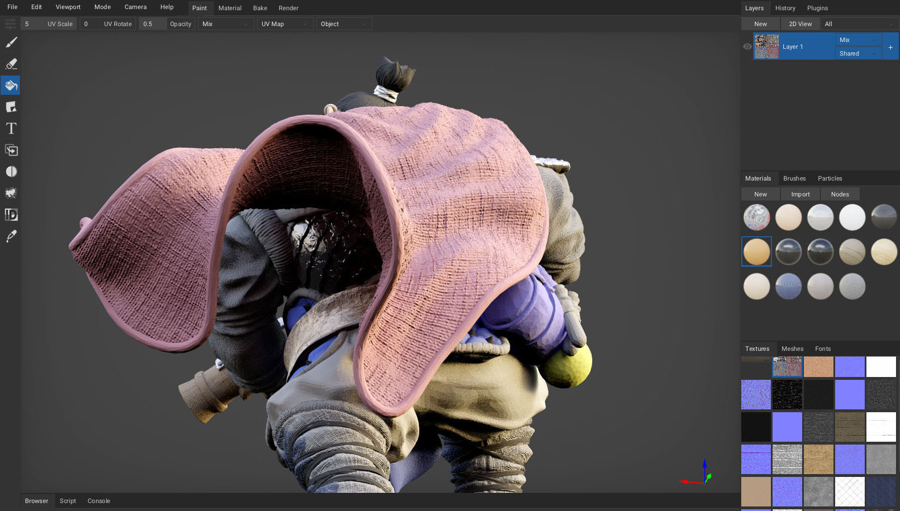

Select [Bake tool](https://armorpaint.org/manual/#/?id=bake) from toolbar to perform baking.

- `AO (DXR, VKRT)`: Bake ambient occlusion. `Strength`, `Radius` and `Offset` can be configured.
 <a href="img/bake/a.jpg" target="_blank">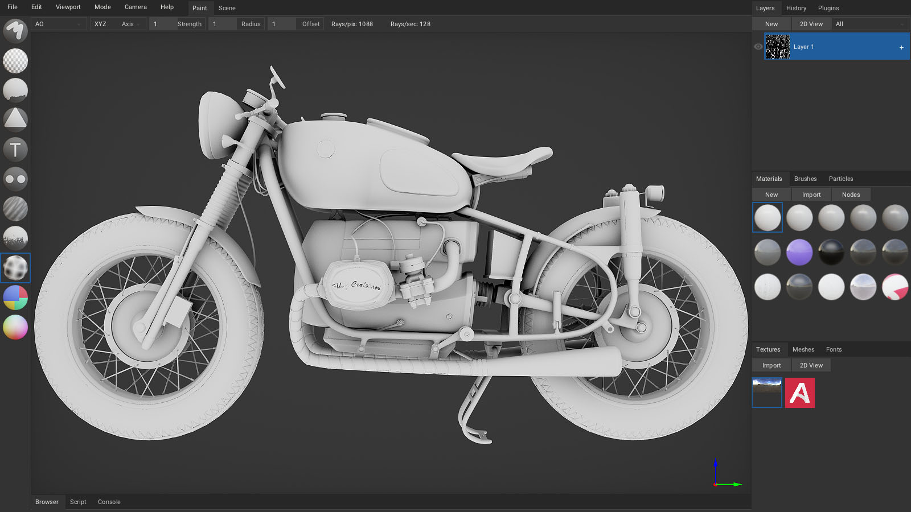</a>

- `Curvature`: Bake mesh curvature. `Strength`, `Radius` and `Offset` can be configured.
 <a href="img/bake/b.jpg" target="_blank">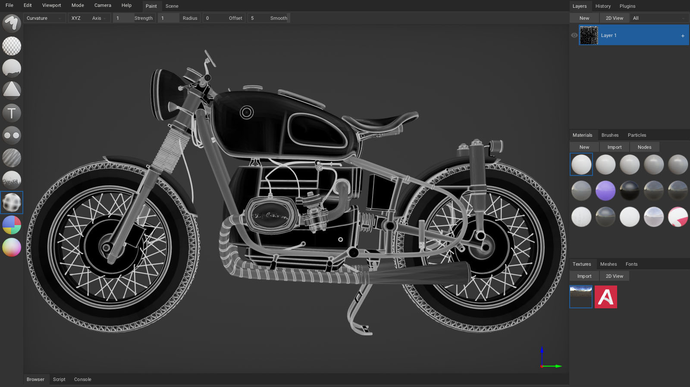</a>

- `Lightmap (DXR, VKRT)`: Bake irradiance from the environment.
 

- `Bent Normal (DXR, VKRT)`: Bake the normals indicating the least occluded direction for a point.
 

- `Thickness (DXR, VKRT)`: Bake mesh thickness. Works similar to AO baker, but uses flipped normals.
 

- `Normal`: Bake normal map from high-poly mesh.
- `Object Normal`: Bake object-space normals encoded into (0-1) range.
- `Height`: Bake height map from high-poly mesh.
- `Derivative`: Bake derivative normals from high-poly mesh. *wip*
- `Position`: Bake object-space positions encoded into (0-1) range.
- `TexCoord`: Bake mesh uv map.
- `Material ID`: Bake colored material IDs.
- `Object ID`: Bake colored object IDs.
- `Vertex Color`: Bake vertex color data.

> *DXR* - This feature is powered by hardware accelerated ray-tracing using DXR and Direct3D12, available in experimental [ArmorPaintDXR](https://github.com/armory3d/armorpaint/blob/master/Assets/readme/readme_dxr.txt) builds.

> *VKRT* - This feature is powered by hardware accelerated ray-tracing using VKRT and Vulkan, available in experimental [ArmorPaintVKRT](https://github.com/armory3d/armorpaint/blob/master/Assets/readme/readme_vkrt.txt) builds.

> Use `AO` baker with small `Radius` to bake `Cavity`.

> Use `Curvature` baker to create dirt masks.
>  <a href="img/curvature.jpg" target="_blank">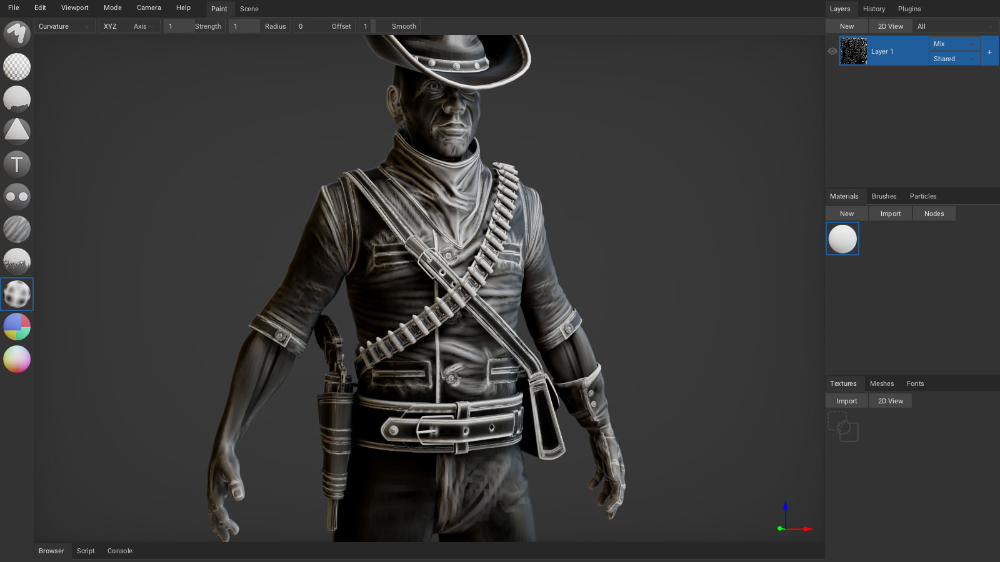</a>

     

# Workspaces

Select workspace tab from the header bar:
- `Paint`: Texture painting, material composition.
- `Scene`: Scene composition. *wip*

     

# Preferences

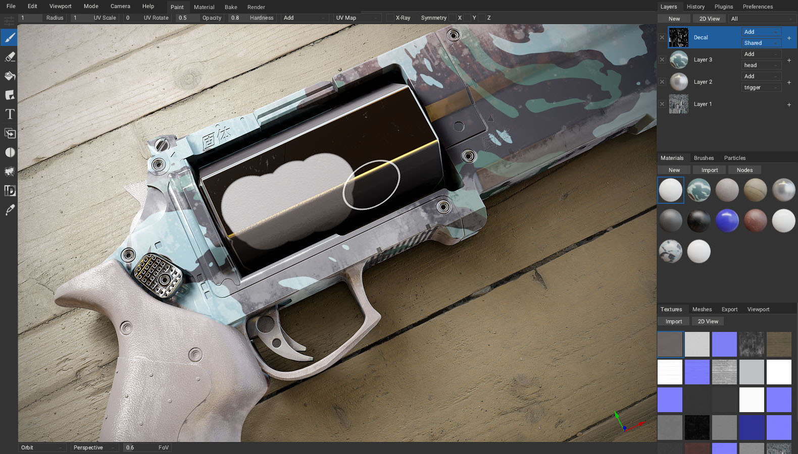

Click `Menu bar - Edit - Preferences...` to show the preferences window.

#### Interface

- `Language`: Set localization. See [currently available translations](https://github.com/armory3d/armorpaint/tree/master/Assets/locale).
- `UI Scale`: Scale up the user interface when running on high-resolution display. By default, 2X scale is applied during the first startup for high-resolution displays.
- `Theme`: Select `dark` or `light` theme. Theme can be tweaked by enabling the `theme_editor` plugin. New themes can be placed into the `ArmorPaint/data/themes` folder.
- `Native File Browser`: Use file dialogs provided by the operating system when browsing for files.
- `Show Asset Names`: Draw labels below each material, brush and texture icon.
- Click `Restore` button to revert back to default settings.

#### Usage

- `Undo Steps`: Set the number of undo steps to keep. Using less undo steps may improve performance when running on GPU with constrained memory.
- `Paint Bleed`: Stretch brush strokes on the uv map to prevent seams.
- `Dilate Radius`: Stretch bake result on the uv map to prevent seams.
- `3D Cursor`: Enable topological warp for paint cursor with depth and angle rejection.
- `Live Brush Preview`: Show brush paint preview in the viewport and 2d view.
 <a href="https://www.youtube.com/watch?v=O5ccQBbKc48" target="_blank">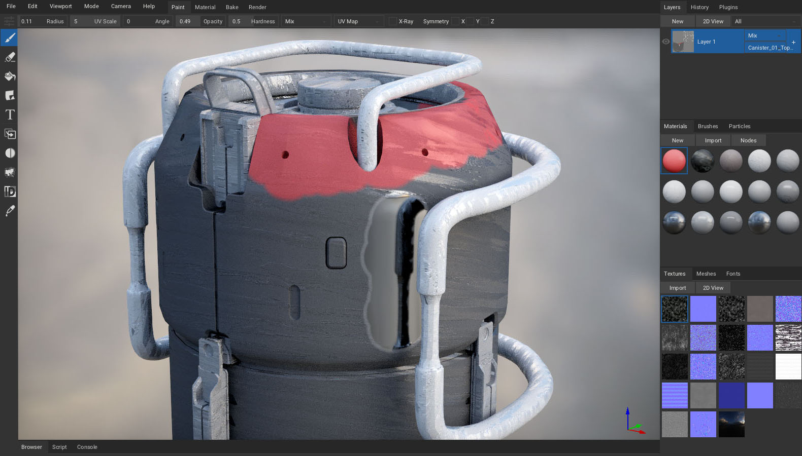</a>

#### Pen

- `Brush Radius`: When painting with a pen, pressure affects the radius of brush.
- `Brush Hardness`: Pressure affects the hardness of brush.
- `Brush Opacity`: Pressure affects the opacity of brush.
- `Brush Angle`: Pressure affects the angle of brush.
- `Sensitivity`: Manual pen pressure sensitivity control.

> ArmorPaint uses `Windows Ink` API on Windows. `Windows Ink` is available on Windows 8 or newer.

> When using a Wacom tablet on Windows, ensure `Use Windows Ink` option is enabled in [Wacom Tablet Properties](https://armorpaint.org/manual/img/wacom.png).

> When using a Wacom tablet on Windows, you can rotate the viewport by assigning `Alt` + `Left click` modifier onto pen button in [Wacom Tablet Properties](https://armorpaint.org/manual/img/wacom_button.png).

> Pen pressure is expected to work on Windows, Linux, macOS, Android and iOS.

#### Viewport

On faster GPUs:
- Raise `Super Sample` to 2X/4X for improved anti-aliasing.
- Enable `Voxel AO` for cone-traced ambient occlusion and shadows (non dxr / vkrt builds).

On slower GPUs:
- Disable `SSAO (screen-space ambient occlusion)` for improved performance.

Additional options:
- Set clipping values with `Clip Start` and `Clip End`.
- Enable `SSR` for screen-space reflections
- Enable `Bloom`
- Set `Vignette` intensity

#### Keymap

Select an existing preset or define custom keyboard shortcuts.
- Use `left`, `middle`, `right` handles to reference mouse buttons / pen.
- Use `+` character to reference multiple keys: ie. `ctrl+1`.

     

# Plugins

Press `Plugins tab - Manager` to open the plugin manager.

- Click `Import` to install a new plugin from `.js`, `.wasm` or `.zip` file.
- Click `New` to create a new hello-world plugin.
- Enable desired plugins from the list.
- Right-click onto plugin name to expose plugin operations:
  - `Export` plugin file for distribution.
  - `Edit` plugin in a text editor.
  - `Delete` plugin.
- Controls for enabled plugins are displayed in the `Plugins tab`.
- Some plugins may not expose controls but add new import / export file formats.

#### Live-Link

Live-link plugins are currently in development:
- [Unreal](https://github.com/armory3d/armorpaint_unreal)
- [Unity](https://github.com/armory3d/armorpaint_unity)
- [Blender](https://github.com/PiloeGAO/Blender-ArmorPaintLiveLink) (created by Léo Depoix)
- [Maya](https://github.com/PiloeGAO/Maya-ArmorPaintLiveLink) (created by Léo Depoix)

#### Plugin Development

Plugins are written in `JavaScript` or `WebAssembly` (compiled from `C`, `Rust`, ..). For a minimal example, see the [bundled](https://github.com/armory3d/armorpaint/tree/master/Assets/plugins) `hello_world.js` file located in the `Armorpaint/data/plugins` folder. A plugin development guide will be provided soon.

     
