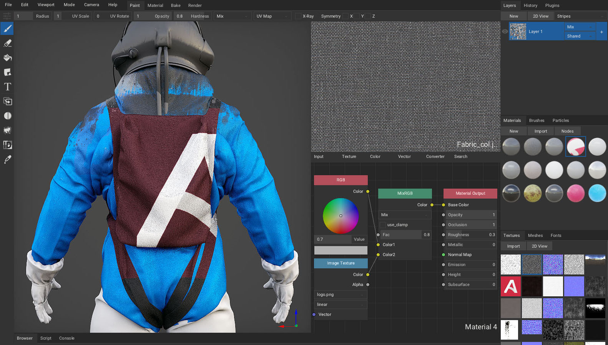
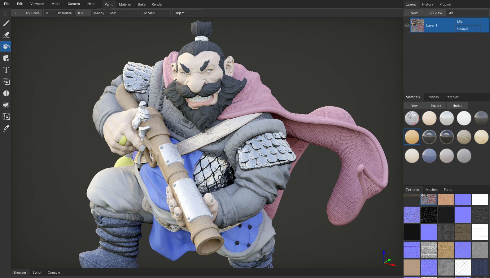
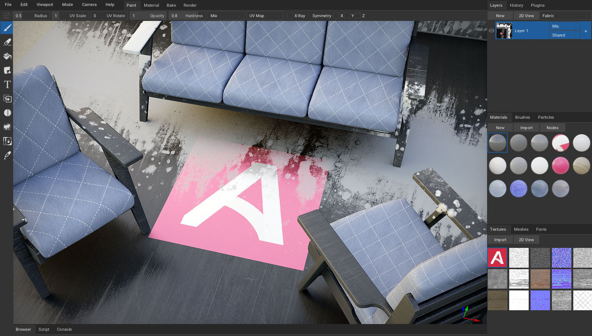

# Welcome


ArmorPaint is a stand-alone software designed for physically-based texture painting. Drag & drop your 3D models and start painting. Receive instant visual feedback in the viewport as you paint.

*The preview version has many rough edges and the experience may be frustrating.*

---

# Download

**Windows** and **Linux** is recommended. An unsigned **macOS** build is also provided. ArmorPaint is a portable application with no installation, just unpack and run.

[Get ArmorPaint](http://armorpaint.org/download.html)

#### Requirements

Painting process in ArmorPaint runs on the GPU and the performance mainly depends on a graphics card. Minimum for 4K painting is an Intel HD4000 graphics card. For 16K painting, GTX 1060/6GB or better is recommended.

*See [Preferences](http://armorpaint.org/manual/#/?id=preferences) to tune performance*

<br/><br/><br/><br/><br/>


# Get Started

<iframe width="560" height="315" src="https://www.youtube.com/embed/0LrMx2mmWi0?rel=0" frameBorder="0" allow="autoplay; encrypted-media" allowfullscreen></iframe>

#### Windows

Unpack downloaded archive and run `ArmorPaint.exe`. In some cases, Windows may prompt you with the unrecognized app dialog - press `More Info - Run Anyway`.

#### Linux

Unpack downloaded archive and run `ArmorPaint`. In some cases, you may need to open terminal in the extracted folder and run `./ArmorPaint`.

#### macOS

*Experimental:* Unsigned app is provided. See `instructions.txt` file in the extracted folder.

#### Controls

- `Left mouse button / Pen` to paint
- `Right mouse button` to rotate the camera
- `Middle mouse button` to pan the camera
- `Mouse wheel` to zoom in and out
- See button tooltips and `Preferences tab - Controls` for keyboard shortcuts

<br/><br/><br/><br/><br/>


# Workflow


You can download sample assets for testing [here](https://github.com/armory3d/armorpaint_samples/releases).

#### Import Meshes

Drag and drop unwrapped `.obj` file into the viewport. This will replace the currently painted mesh. `.fbx`, `.blend` and `.gltf` files are supported, but the importer is not 100% reliable yet.

- Enable `Meshes tab - UDIM Import` if you wish to split imported mesh per UDIM tile.
- Normals can be re-calculated with `Meshes tab - Calculate Normals`.
- Up axis can be set with `Meshes tab - Up Axis`.

#### Import Materials

Drag and drop a folder with PBR texture set onto the viewport. ArmorPaint will recognize the file extensions and create a new material from imported textures.

#### Import Textures

Drag and drop `.jpg`, `.png`, `.tga` or `.hdr` images into the node editor. This will import the image and place a new `Image` node onto the canvas.

#### Export Textures

Click on the `Export tab - Export Textures - Export` button. Selected layer will get exported into textures. Format, resolution and channels to export can be configured.

#### Export Mesh

Click on the `Export tab - Export Mesh - Export` button to save the currently loaded mesh into an `.obj` file. This is handy if you only have access to the `.arm` project file.

#### Save / Load Project

Click on the `File - Save` menu item (`Ctrl + S`) to save the currently opened project. Mesh, layers and materials will be saved into `.arm` project file.

To open the project file, drag and drop `.arm` file onto the viewport.

<br/><br/><br/><br/><br/>


# Materials



Materials in ArmorPaint are composed with nodes. When painting, brush applies a material onto the surface. To setup a material, open node editor by clicking `Materials tab - Nodes` (`TAB`). Use toolbar at the top to add new nodes.

The material preview is displayed instantly in the `Materials tab` as the nodes are assembled.

Right-clicking onto the material preview allows to set which channels the material should affect.

*See [Import Materials](http://armorpaint.org/manual/#/?id=import-materials)*

<br/><br/><br/><br/><br/>


# Tools


#### Brush


Select `Brush`(`B`) tool from toolbar. Configure brush parameters in the header. Use `left mouse button` / `pen` to paint strokes using the selected material.

- `Radius`: Brush size. (Hold `F` key and move the mouse / pen to the left / right.)
- `UV Scale`: Scale the coords for currently painted material.
- `UV Rotate`: Rotate the coords for currently painted material.
- `Opacity`: Overall opacity of the brush stroke.
- `Hardness`: Fade opacity towards the brush stroke edge.

#### Eraser


Select `Eraser`(`E`) tool from toolbar. Use `left mouse button` / `pen` to erase strokes on the currently selected layer.

- `Radius`: Brush size. (Hold `F` key and move the mouse / pen to the left / right.)
- `Opacity`: Overall opacity of the brush stroke.
- `Hardness`: Fade opacity towards the brush stroke edge.

#### Fill


Select `Fill`(`G`) tool from toolbar. Press `left mouse button` / `pen` to fill active layer with selected material. Fill tool respects active object mask, material mask and color id mask.

- `UV Scale`: Scale the coords for currently painted material.
- `UV Rotate`: Rotate the coords for currently painted material.
- `Opacity`: Overall opacity of the fill effect.
- `Fill Mode`: Allows to fill individual mesh faces.

#### Decal


Select `Decal`(`D`) tool from toolbar. Press `left mouse button` / `pen` to apply active material as a decal onto the surface.

- `Radius`: Decal size. (Hold `F` key and move the mouse / pen to the left / right.)
- `UV Scale`: Scale the coords for currently painted material.
- `UV Rotate`: Rotate the coords for currently painted material.
- `Opacity`: Overall opacity of the decal.
- `Mask`: Apply shape mask to the decal.

#### Text


Select `Text`(`T`) tool from toolbar. Press `left mouse button` / `pen` to apply active material as a text onto the surface. Drag and drop a `.ttf` file into the viewport to change the font.

- `Radius`: Text size. (Hold `F` key and move the mouse / pen to the left / right.)
- `UV Scale`: Scale the coords for currently painted material.
- `UV Rotate`: Rotate the coords for currently painted material.
- `Opacity`: Overall opacity of the text.
- `Font`: Select which font to apply.
- `Text`: Type a text to apply.

#### Clone


Select `Clone`(`L`) tool from toolbar. Hold `ALT` to set clone source location. Use `left mouse button` / `pen` to clone the material from source location to active location.

- `Radius`: Brush size. (Hold `F` key and move the mouse / pen to the left / right.)
- `Opacity`: Overall opacity of the brush stroke.

#### Blur


Select `Blur`(`U`) tool from toolbar. Use `left mouse button` / `pen` to smudge the material applied to the surface.

- `Radius`: Brush size. (Hold `F` key and move the mouse / pen to the left / right.)
- `Opacity`: Overall opacity of the brush stroke.

#### Particle


Select `Particle`(`P`) tool from toolbar. Use `left mouse button` / `pen` to apply particles onto the surface.

- `Radius`: Particle emitter size. (Hold `F` key and move the mouse / pen to the left / right.)
- `Opacity`: Overall opacity of the emitted particle.

#### Bake


Select `Bake`(`K`) tool from toolbar.

**AO**

Press `left mouse button` / `pen` to bake ambient occlusion. Strength, radius and offset can be configured. Afterwards, you can prevent the occlusion channel from being painted on by disabling it in the `Paint Maps` panel.

#### Color ID


Select `Color ID`(`C`) tool from toolbar. Drag and drop color-id texture onto the viewport and assign it into the `Color ID Map` field. Afterwards, click on a model to pick a specific color. All drawing operations will now be restricted to this color. Picked color can be removed with a `Clear` button.

#### Picker


Select `Picker`(`V`) tool from toolbar. Press `left mouse button` / `pen` to read material values from the surface. Base color, normal, occlusion, roughness and metallic values will be displayed in the header.

- `Select Material`: When enabled, the material you pick from the mesh surface will also get auto-selected in the `Materials tab`.
- `Mask`: When set to `Material`, all drawing operations will be restricted to the surface where picked material is painted.

<br/><br/><br/><br/><br/>


# Painting



#### Layers

To create a new layer, press `Layers tab - New`. Brush will paint onto the currently selected layer.
- Layer can be parented to the specific object by setting the `Object` combo property.
- Reveal the layer properties by clicking the `+` sign to set layer `opacity`.

Right-click on the layer to expose layer operations:
- Convert layer to `fill layer` or `paint layer`.
- Create a `mask`.
- `Merge` the layer down.
- `Duplicate` the layer.
- `Move` the layer up or down.
- `Delete` layer.
- Set which channels the layer should affect.

*Note: Operations for the base (first) layer are restricted.*

#### 2D View

Click `Layers tab - 2D View` to show the channels of the selected layer. The 2D View is updated immediately as you paint. In the top bar, you can select which channel to show or display UV map as a wireframe.

The paint tools are also usable directly inside the `2D View`.

#### Camera

Set camera type and parameters in the status bar.

- `Rotate` - rotate mesh around the origin
- `Orbit` - rotate camera around the mesh
- `Fly` - hold `right mouse button` and move camera freely using the `WASD` and `QE` keys

Press `menu bar - View` to set specific camera viewpoint.

#### Viewport

- Set `Light` and `Environment` intensity
- Set `Light Size`
- Display specific channel in the viewport
- Enable `Show Envmap` to draw environment map in the viewport
- Drag and drop a `.hdr` file onto the viewport to change the environment map
- Show `Wireframe` in the viewport
- Show ruler `Grid` in the viewport
- Show 3D `Compass` in the viewport

<br/><br/><br/><br/><br/>


# Workspaces



Select workspace from the header bar:
- `Paint`: Texture painting
- `Scene`: Scene composition
- `Material`: Node-based material creation

<br/><br/><br/><br/><br/>


# Preferences

- `UI Scale`: Scale up the user interface when running on high-resolution display.
- `Layout`: Pin properties window to the left or right side.
- `Theme`: Select `Dark` or `Light` theme. Theme can be tweaked by editing the `theme_dark.arm` file placed in the `/data` folder. A proper theme editor will be provided in the future.
- `Undo Steps`: Set the number of undo steps to preserve. Using less undo steps may improve performance when running on GPU with constrained memory.
- `Pen Pressure`: When painting with a pen, pressure affects the radius of brush.

##### Viewport Quality

On faster GPUs:
- Raise `Super Sample` to 2X/4X for improved anti-aliasing.
- Enable `Voxel AO` for cone-traced ambient occlusion and shadows.

On slower GPUs:
- Disable `SSAO` for improved performance.

<br/><br/><br/><br/><br/>


# Plugins

To enable plugins, edit the `config.arm` file placed in the `/data` folder. A plugin filename can be entered into the `plugins` array. A proper plugin manager will be provided in the future.

Plugins are written in JavaScript or WebAssembly. For a minimal example, see the bundled [plugin_hello.js](https://github.com/armory3d/armorpaint/blob/master/Bundled/plugins/plugin_hello.js) and [plugin_rotate.js](https://github.com/armory3d/armorpaint/blob/master/Bundled/plugins/plugin_rotate.js) files located in the `/data` folder.

```json
{
	...
	"plugins": ["plugin_hello.js"]
}
```
